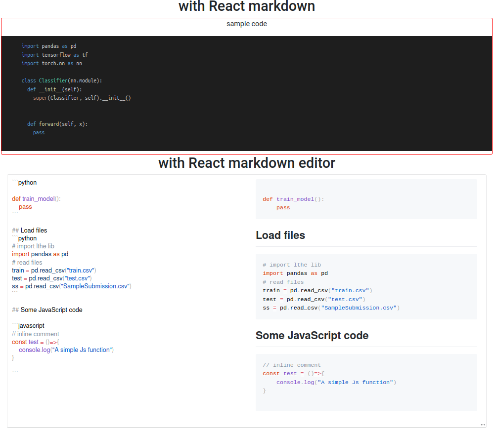

# This is a simple code editor project created for some experiments.

In this repo I'll be using react components to build an online `Markdown-based` code editor

# Preview
<p align="center">
  
</p>

# Usage

## Step 1

First clone this repository 

```
$ git clone https://github.com/dric2018/code-editor.git
```

## Step 2

Then, move into the `project directory` to install the dependencies. You need to have npm (and `node v12 or later`) already instaled.


```
$ cd code-editor
$ npm install
# if there are some vulnerabilities
# then run :
# npm audit fix --force 
```

## Step 3 

You are ready to launch the web app. Now run:

```
$ npm start

## outputs
> code-editor@0.1.0 start <path_to_cloned_project>
> react-scripts start

Compiled successfully!

You can now view code-editor in the browser.

  http://<your hostname or localhost>:3000

Note that the development build is not optimized.
To create a production build, use npm run build.
```